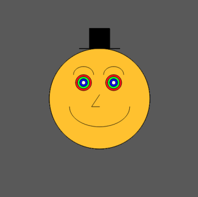

It's important to step back and get some perspective about your progress with
any skill. And considering the mammoth idea of taking a career side step into
programming, and my general high expectations for myself; I thought to begin a
post series titled _The Noob Chronicles_, where I look back in time since the
last chapter and review what's happend since then. This is the first chapter and
I'm _not_ going back to birth...

## Music, Art and For Loops

It's been two years since I learnt want a for loop is. Since then the ball has
been rolling with great joy, but cracks are appearing on its surface. I heard
quite early on that the more you learn, the more you realise how much you don't
know.

I've never felt this more than with programming.

In music and art, a lot of your technique, creativity and craft is hidden, in
that the "source code" of a music file or image output is not observable. There
is often no reference material at all for the public to unpack how you made that
content. And often, there can also be no material for yourself to look back on
(as in the case of improvised music or setups using a modular synthesiser which
no longer holds the same patch).

In programming, the technique and craft of others is very often visible due to
open-source development, but also tutorials, APIs, and internal code bases. And
as you start to learn, you start to understand parts of what you're looking at,
but become very much aware of how much you have no clue about.

The difference here between arts and programming, is that the process of
learning to program has much larger gaps between moments of gratification. Or
put otherwise, the hurdles are larger and further in between than when making
music and art.

With music and art, it more often than not feels good all the time. Playing
music in particular creates a symbiosis between your body (playing the
instrument), your mind (accessing your creativity, memories and emotions) and
your environment (hearing the result of body and mind, echoed into the room).
Actually, this is why it's very hard to be even a _good_ singer. It takes _a
lot_ of training to listen to the _actual_ sound and pitch of your voice and to
correct it, as apposed to hearing what you _think_ your pitch is.

With programming, you are not given so much leeway. Usually things just don't
work _at all_; Like opening your mouth to sing and excrement just spraying out,
bouncing off the wall and hitting the fan, leaving you standing dumbfounded in a
brown haze.

On this topic, I wrote how I think
[polishing your tools is a good thing](a-case-for-polishing-your-tools). It
discusses how tinkering, or hacking on your setups or tools can actually teach
you a lot. And this is valuable. But each little optimization or little bug fix
in your setup also allows for much smaller spans of time and effort between
moments of gratification.

It's very true, that learning to code can happen much faster if you can apply it
within a project that you are invested in - in the case of the above post,
Neovim.

## Filling in Gaps

The hardest thing in my programming education or me has been filling in the
gaps. As stated, I first learnt what a for loop was two years ago, and this was
at the start of my masters degree. It's not a computer science masters, but a
very large part of it deals with programming languages.

I'm studying a Masters of Creative Technologies, which essentially gears you up
to be a highly proficient operator at the interaction of technology, media and
art.

My personal trajectory though, is to become a software engineer, and I want be
as good as I can be. As I completed my various class assignments, moving through
python, JavaScript, c++, Java, lua and fields of graphics, audio, interaction,
networking, machine learning, cyber security, web development and games, I
became chronically aware of how many foundational elements were being glossed
over or skipped entirely. This is natural of course. The more things learned in
a given amount of time, the more superficially they will have to be learned.

To fill the gaps, I went searching for drop in replacements for full computer
science knowledge. This lead me to resources like
[Computer Science from the Bottom Up](https://bottomupcs.com/), an online web
version of
[Structure and Interpretation of Computer Programs](https://github.com/sarabander/sicp),
and of course the well known
[Nand to Tetris series](https://www.nand2tetris.org/).

Progress has however been slow. I've finished my course work as of July this
year, so have only had enough brain space since then to start looking at
learnings outside my own masters courses.

I'm also gradually chipping through
[Clean Code: A Handbook of Agile Software Craftsmanship](https://www.goodreads.com/book/show/3735293-clean-code),
[The Go Programming Language (book)](https://www.gopl.io/),
[The Algorithm Design Manual](https://www.algorist.com/) and waiting for me is a
dense beast I got for free titled
[Internetworking with TCP/IP](https://www.oreilly.com/library/view/internetworking-with-tcpip/9780137464197/)

## Back Patting

I don't want to come across as a self righteous prick now. But I do want to put
my skill progressions into perspective. For myself to look back on, and also any
other person also grappling with the huge initial learning curve of programming.

So please read this like you're reading my personal diary. In a large sense,
that is actually [what this blog is](/posts/hello-world).

Shortly after learning what a for loop is, I programmed the below image. So it
would be the first thing I ever programmed; an illustrious and provocative work
made with Processing4.

Since then I've...

- implemented machine learning algorithms that
  [provide useful information](https://github.com/tjex/pdf-correlator).
- built a tool that I've wanted to have for at least eight years, a
  [Tombola Sequencer](https://github.com/tjex/ofTombola-sequencer), written in
  C++.
- worked with others to build a continuous integration server from scratch on a
  Raspberry PI
- become markedly proficient with Neovim and just weep with joy with how god
  damn easy it is to work with text and files compared to before.
- built my own website from scratch _and actually make conscious design
  decisions that I follow through on_.
- studied a full semester of computer science at one of the most notable
  engineering schools in Europe (KTH, Stockholm) and survived.
- became proficient with git and feel safe and confident to try out changes
  quickly and deeply within my projects.
- become comfortable reading and implementing API documentation.
- learned my way around JavaScript, Python, Go, HTML, CSS, Lua and Bash to a
  degree that is on average between functional and mediocre.
- solved a real world creative problem with code during an
  [artistic project](https://github.com/tjex/WOMB-Installation).
- reinvigorated my musical side and creative palette with
  [TidalCycles](https://tidalcycles.org/), allowing me to do things that are
  otherwise incredibly arduous or complex otherwise.
- made useful contributions to real world open-source projects.
- manually setup an encrypted install of Artix Linux and used it as a daily
  driver, until I got sick of poor hardware performance compared to my M1 Mac...
- researching into topics of distributed systems, conflict-free replicated data
  types, ActivityPub, LoRaWAN, Multi-agent systems and pattern generation for my
  masters thesis - and can actually comprehend what I'm reading.

## Until Next Time

My main goals / tasks from here are to:

1. finish my masters thesis
2. learn algorithms
3. learn JavaScript, Go, Node and Flutter
4. up my Machine Learning skills
5. learn about distributed systems and the respective technologies

Let's see what happens up until chapter two!
